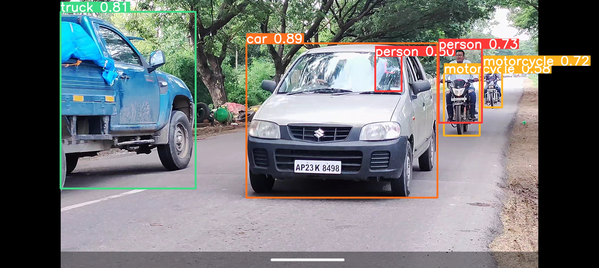
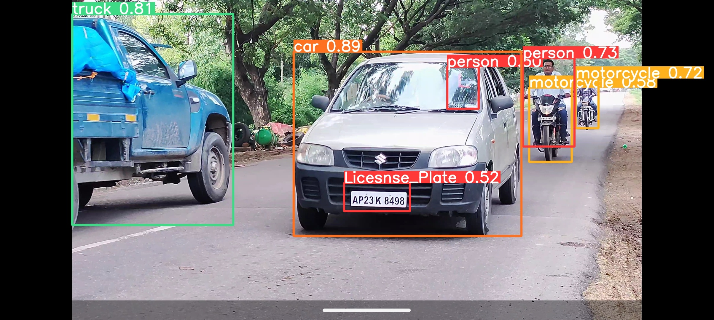

# Moving-Vehicle-Registration-Number-Detection


## Overview
This project is designed to detect and recognize vehicle registration numbers (license plates) from video footage. It employs object detection, tracking, and optical character recognition (OCR) to identify vehicles, track them, and extract text from license plate. It is designed for applications in traffic monitoring, security, and surveillance. The model achieves high accuracy with a recall of 93.8% and a precision of 88.73%, effectively identifying license plates even under varying speeds and lighting conditions. Its performance is further validated by an mAP50 score of 95.3%, showcasing its robustness in real-world scenarios.

## Project Structure
Here's an overview of the key files and their roles in the repository:

- **main.py**: Main script for processing video, detecting vehicles, and extracting license plate text.
- **sort.py**: Implementation of the SORT (Simple Online and Realtime Tracking) algorithm.
- **best.pt**: Pre-trained YOLOv8 model for license plate detection.
- **kia_alto.mp4**: Sample video for testing the detection workflow.
- **README.md**: Project documentation (this file).

## Methodology

### Training Data Set
The detection model was trained using the License Plate Recognition Dataset from Roboflow Universe, containing over 24,000 annotated images of license plates. This dataset offers a diverse range of conditions, providing robust training for real-world applications. The model uses YOLOv8 for its high accuracy and speed in real-time applications.

### Vehicle Detection with YOLOv8
YOLOv8n is applied to each frame in the video to detect vehicles. The model divides each frame into a grid, predicting bounding boxes and class probabilities for various vehicle types, including cars, trucks, buses, motorcycles, and bicycles. The output includes bounding boxes and class probabilities, with visual representation on the video frame.



### License Plate Detection and Assignment
After vehicle detection, a dedicated YOLOv8 model identifies license plates in each frame. The output bounding boxes are then associated with detected vehicles, ensuring each license plate is linked to the correct vehicle.



### Unique Tracking with SORT
To maintain tracking across frames, SORT uses Kalman filtering to estimate the state of each detected vehicle and data association to link objects across frames. This approach assigns a unique track ID to each vehicle, allowing consistent tracking throughout the video.

### License Plate Region Extraction and OCR
The identified license plate region is extracted from the frame and converted to grayscale to improve OCR accuracy. EasyOCR, a Python library for optical character recognition, extracts text from the grayscaled region. The OCR output is cleaned to remove errors such as spaces, punctuation, and other non-essential characters.

### Storing and Retrieving the Best Text
The extracted text and its confidence score are stored in a dictionary, indexed by frame number and unique track ID. To find the best text for each vehicle, the algorithm compares all results and selects the one with the highest confidence score. Duplicates are removed for accuracy.

## Installation
To set up the project, ensure you have Python installed and the following libraries:

- **ultralytics**: For YOLOv8 object detection.
- **easyocr**: For optical character recognition.
- **cv2** (OpenCV): For video processing.
- **numpy**: For numerical operations.
- **scikit-image**: For image processing.
- **filterpy**: For Kalman filtering (used in SORT).
- **lap**: A dependency for the SORT algorithm.

Install these dependencies with the following command:

```bash
pip install ultralytics easyocr opencv-python-headless numpy scikit-image filterpy lap
```

## Cloning the Repository
To clone the repository and navigate to its directory, use these commands:

```bash

git clone https://github.com/sathviksvn/Moving_Vehicle_Registration_Number_Detection.git
cd Moving_Vehicle_Registration_Number_Detection
```

## Usage
To run the project and test the detection on the sample video:

Clone the repository and navigate to its directory.
Ensure the kia_alto.mp4 video file and best.pt YOLOv8 model are in the same directory as main.py.
Execute main.py with Python to process the video and detect license plates:
```bash
python main.py
```
